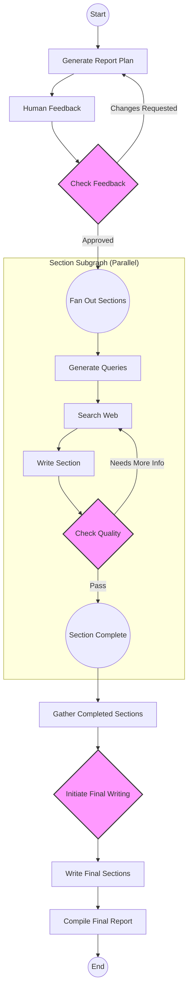
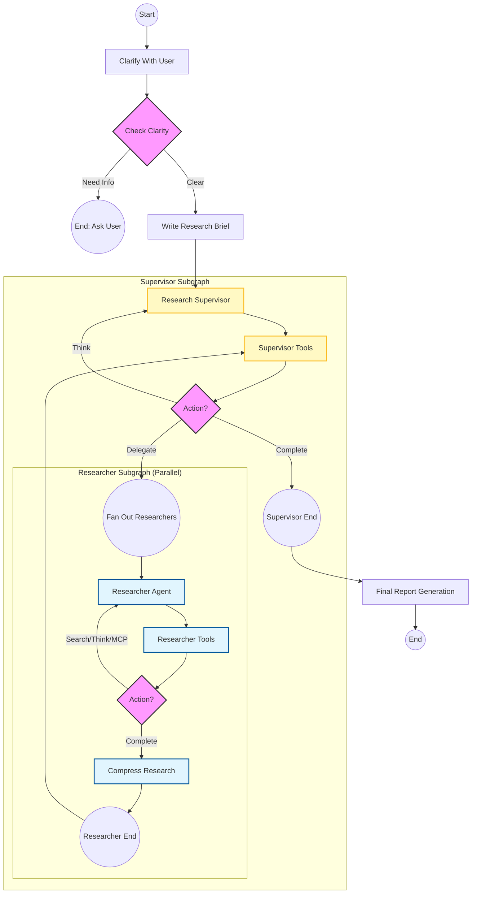

# Graph Implementation Architectures

This document visualizes the three different LangGraph architectures found in this workspace.

## 1. Iterative Search Graph (Local)
**File:** `backend/src/agent/graph.py`
**Type:** Flat Graph with Parallel Fan-out
**Goal:** Answer a specific question through iterative refinement.

```mermaid
graph TD
    classDef conditional fill:#f9f,stroke:#333,stroke-width:2px;
    classDef node fill:#fff,stroke:#333,stroke-width:2px;
    
    START((Start)) --> generate_query[Generate Query]
    generate_query --> planning_mode[Planning Mode]
    
    planning_mode --> check_plan{Planning Router}
    class check_plan conditional
    
    check_plan -- "/plan" --> planning_wait[Planning Wait]
    check_plan -- "/confirm" or "/end_plan" --> fan_out_research((Fan Out))
    
    planning_wait --> check_plan_wait{Planning Router}
    class check_plan_wait conditional
    check_plan_wait -- Wait --> planning_wait
    check_plan_wait -- Confirm --> fan_out_research
    
    fan_out_research --> web_research[Web Research]
    
    subgraph Parallel Execution
        web_research
    end
    
    web_research --> validate_web_results[Validate Results]
    validate_web_results --> reflection[Reflection]
    
    reflection --> evaluate{Evaluate Research}
    class evaluate conditional
    
    evaluate -- "Is Sufficient / Max Loops" --> finalize_answer[Finalize Answer]
    evaluate -- "Knowledge Gap" --> fan_out_research
    
    finalize_answer --> END((End))
```

## 2. Section-Based Report Graph (Legacy)
**File:** `src/legacy/graph.py`
**Type:** Map-Reduce Style with Subgraphs
**Goal:** Write a structured report by researching sections in parallel.



## 3. Hierarchical Deep Research Graph (New)
**File:** `src/open_deep_research/deep_researcher.py`
**Type:** Hierarchical Multi-Agent (Supervisor-Worker)
**Goal:** Conduct deep, autonomous research with managed teams.


