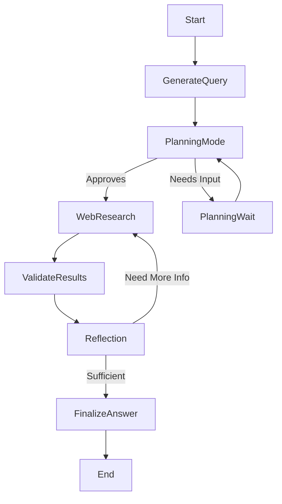
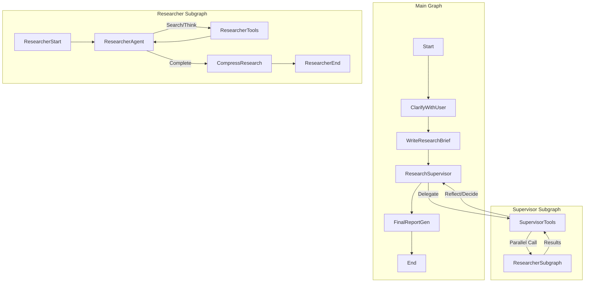
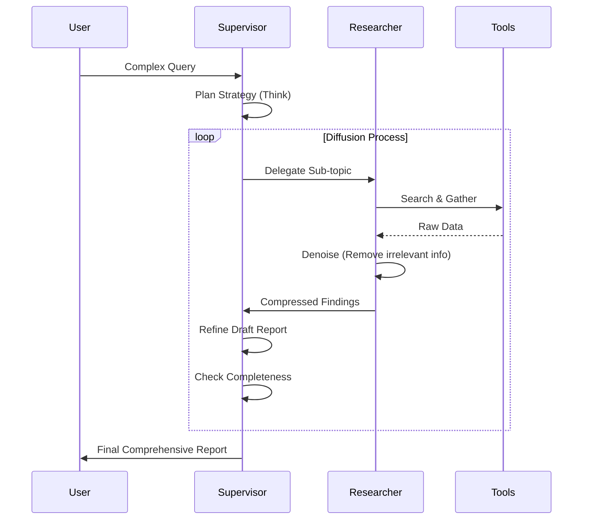

# Deep Research Implementation Analysis

## Executive Summary

This report compares the current `pro-search-agent` implementation against two "Deep Research" reference implementations (`thinkdepthai/Deep_Research` and `langchain-ai/open_deep_research`) and analyzes the integration of the **DeepResearch-Bench** framework.

**Key Findings:**
1.  **Architecture Gap:** The current agent uses a flat, iterative loop. Reference implementations use a **hierarchical Supervisor-Worker** pattern with explicit **parallelism**.
2.  **Prompt Engineering:** Reference prompts are significantly more detailed, employing a "Diffusion Algorithm" (Plan -> Research -> Denoise/Refine) and strict output protocols.
3.  **Evaluation:** The **DeepResearch-Bench** framework (RACE and FACT metrics) provides a rigorous standard for evaluating report quality and citation accuracy, which is currently missing.

---

## 1. High-Level Architecture Comparison

### Current Implementation (`pro-search-agent`)
A linear, single-threaded loop with a human-in-the-loop "Planning Mode".



### Reference Implementation (`Open Deep Research`)
A hierarchical graph where a Supervisor delegates to multiple Researcher sub-agents (running in parallel), each with their own tool loops.



### Gap Analysis

| Feature | Current Agent | Reference Implementations | Impact of Gap |
| :--- | :--- | :--- | :--- |
| **Orchestration** | Single Loop | **Supervisor + Sub-agents** | Reference scales to complex multi-topic queries better. |
| **Concurrency** | Sequential Search | **Parallel Execution** | Reference is faster for broad topics; Current is slower. |
| **Scope Definition** | Implicit | **Clarification Node** | Reference ensures user intent is locked before starting. |
| **Context Mgmt** | Raw Summaries | **Compression Step** | Reference handles large context windows better by condensing notes. |
| **Prompting** | Direct Instruction | **Diffusion/Denoise** | Reference produces higher fidelity, less noisy outputs. |

---

## 2. Deep Research Logic Flow (The "Diffusion" Pattern)

The reference implementations use a sophisticated "Diffusion" pattern for quality control.



**Recommendation:** We can adopt the **"Denoise/Compress"** step immediately as a node after `web_research` to improve our context quality without a full architectural rewrite.

---

## 3. DeepResearch-Bench Integration Strategy

The **DeepResearch-Bench** framework evaluates agents on two axes:
1.  **RACE (Report Quality):** Uses a Judge LLM (e.g., Gemini 1.5 Pro) to compare the agent's report against a Gold Standard reference.
2.  **FACT (Citation Accuracy):** Measures the quantity and correctness of citations.

### Integration Approach

We should integrate these metrics as a **Parallel Evaluation Node** that can be toggled on/off (e.g., for nightly builds or specific test runs), rather than blocking the main user flow.

#### Proposed Evaluation Architecture

```mermaid
graph LR
    subgraph "Agent Flow"
        FinalizeAnswer --> Output[Final Report]
    end

    subgraph "Evaluation Flow (Async)"
        Output --> EvalNode[DeepBench Evaluator]
        EvalNode --> RACE_Check[RACE Metric (Quality)]
        EvalNode --> FACT_Check[FACT Metric (Citations)]
        RACE_Check --> Dashboard
        FACT_Check --> Dashboard
    end
```

#### Implementation Steps
1.  **Port `bench_race_eval.py`**: Adapt the reference `deepresearch_bench_race.py` to a new module `backend/src/eval/race.py`.
2.  **Create Evaluation Tool**: Expose a tool/node that takes a `(question, generated_report)` pair and runs the RACE check using our existing Gemini client.
3.  **Dataset Import**: Import a subset of the 100 DeepResearch-Bench tasks into `backend/tests/data/deep_bench_samples.json` for regression testing.

---

## 4. Integration Roadmap

### Phase 1: Low-Hanging Fruit (Nodes & Prompts)
*Goal: Enhance current agent using "Node-based" additions.*
- [ ] **Add "Compress/Denoise" Node:** Insert a node after `web_research` that uses the `compress_research_system_prompt` to clean data.
- [ ] **Adopt "Diffusion" Prompts:** Update `prompts.py` with the "Helpfulness/Insightfulness" rules from the reference prompts.
- [ ] **Clarification Step:** Add a `clarify_with_user` node before `planning_mode` to ensure the task is well-defined.

### Phase 2: Structural Evolution (Parallelism)
*Goal: Move towards the Supervisor pattern.*
- [ ] **Split Graph:** Refactor `graph.py` to separate `Researcher` logic from `Planner` logic.
- [ ] **Parallel Execution:** Use LangGraph's `Send` API (already used in `continue_to_web_research` but can be expanded) to run full sub-agent loops in parallel.

### Phase 3: Rigorous Evaluation
*Goal: Benchmark driven development.*
- [ ] **Integrate DeepBench:** Set up a CI/CD job that runs 5 random DeepBench tasks against the agent and scores them using the RACE implementation.

## 5. Reference Materials

The following files have been extracted to `docs/reference/` for direct usage:
- `open_deep_research_graph.py`: Full reference graph implementation.
- `deep_research_prompts.py`: "Diffusion" and "Clarification" prompts.
- `bench_race_eval.py`: The core evaluation logic from DeepResearch-Bench.
