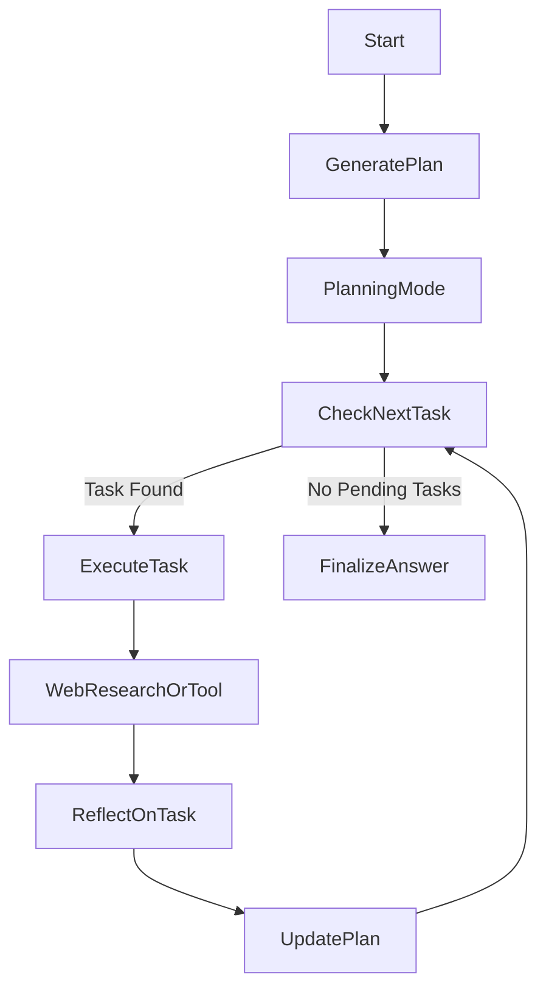

# Design: Open SWE Patterns (Iterative Planning)

## 1. Overview
This document outlines the transition from a linear "Search -> Summarize" loop to an iterative "Plan -> Execute -> Reflect" loop, inspired by [Open SWE](https://github.com/langchain-ai/open-swe). This enables the agent to act as a "Project Manager" capable of maintaining a long-running, dynamic `Todo` list.

## 2. Trade-offs

| Feature | Static Plan (Current) | Dynamic Todo State (Proposed) |
| :--- | :--- | :--- |
| **User Control** | Low (Review initial queries only) | High (Edit/Add/Reorder tasks anytime) |
| **State Complexity** | Low (`List[str]`) | High (`List[Todo]` with status, dependencies, outputs) |
| **Predictability** | High (Deterministic flow) | Variable (Loop continues until 'Done') |
| **Error Recovery** | Hard (Must restart if search fails) | Easy (Mark task failed, add retry task) |

**Decision:** Implement "Dynamic Todo State". The value of handling complex, multi-step research tasks outweighs the state management complexity.

## 3. Architecture

### State Migration
We move from a simple list of query strings to a rich `PlanState`.

#### `Todo` Schema
```python
class Todo(TypedDict):
    id: str
    task: str
    status: Literal["pending", "in_progress", "done", "blocked", "failed"]
    dependencies: List[str]  # IDs of tasks that must finish first
    result: Optional[str]    # Summary of the execution
    tools_used: List[str]    # Meta-data
```

#### `OverallState` Updates
```python
class OverallState(TypedDict):
    # ... existing fields ...
    plan: List[Todo]         # Replaces search_query list in importance
    current_task_id: Optional[str]
```

### Graph Flow Changes

1.  **`generate_query`** -> **`generate_plan`**:
    *   Instead of just queries, generating a `List[Todo]`.
2.  **`planning_mode`**:
    *   Visualizes the `plan`.
    *   Allows user to CRUD tasks.
3.  **`execution_router`** (New):
    *   Selects the next "pending" task.
    *   Routes to `web_research` (for research tasks) or `tool_execution` (for coding/file tasks).
4.  **`reflection`** -> **`update_plan`**:
    *   The LLM reviews the result of the executed task.
    *   It outputs a `PlanUpdate` (e.g., "Mark Task A as Done", "Add Task B (follow-up)").

### Data Flow Diagram



## 4. Proof of Concept (POC) Snippets

### A. Pydantic Models for State (`backend/src/agent/state.py`)

```python
from typing import List, Optional, Literal, TypedDict

class Todo(TypedDict):
    id: str
    task: str
    status: Literal["pending", "in_progress", "done", "blocked"]
    result: Optional[str]

# The update structure the LLM will output
class PlanUpdate(BaseModel):
    completed_task_id: str
    task_outcome: str
    new_tasks: List[str] = Field(default_factory=list, description="New tasks discovered during execution")
    # In a real implementation, new_tasks might be objects to support dependencies
```

### B. Plan Updater Logic (Pseudocode)

```python
def update_plan_node(state: OverallState):
    """
    Reflects on the last executed task and updates the plan.
    """
    last_task = get_current_task(state.plan)
    execution_result = state.web_research_result[-1] # or tool output

    # LLM Call
    update = llm.with_structured_output(PlanUpdate).invoke(...)

    # Apply State Update
    new_plan = state.plan.copy()
    # 1. Mark current done
    mark_task_done(new_plan, update.completed_task_id, update.task_outcome)
    # 2. Append new tasks
    for t in update.new_tasks:
        new_plan.append(create_todo(t))

    return {"plan": new_plan}
```

## 5. Risks & Mitigations
*   **Risk:** Infinite Loops (Agent keeps adding tasks).
    *   *Mitigation:* `max_research_loops` config must be strict. Add a `depth` or `retry_count` to Todos.
*   **Risk:** Context Window Explosion.
    *   *Mitigation:* Summarize "Done" tasks in the prompt; do not feed the entire history of every task execution if not needed.
