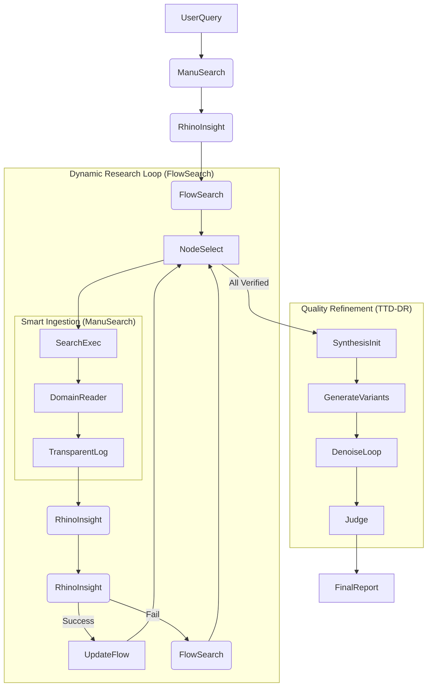

# Deep Research Implementation Guide

This guide provides a detailed implementation roadmap for building a State-of-the-Art (SOTA) Deep Research agent. It synthesizes best practices from top-performing frameworks (FlowSearch, TTD-DR, RhinoInsight, ManuSearch) into a cohesive architecture.

## 1. Unified Architecture: "The Hybrid-SOTA Agent"

We propose a hybrid architecture that combines the strengths of the leading frameworks:

*   **Orchestration**: **LangGraph** (State management & workflow)
*   **Planning**: **FlowSearch** (Dynamic graph-based planning with backtracking)
*   **Verification**: **RhinoInsight** (Checklist-based verification & evidence auditing)
*   **Synthesis**: **TTD-DR** (Iterative denoising for high-quality report generation)
*   **Data Ingestion**: **ManuSearch** (Domain-specific structured readers)

### High-Level Data Flow



---

## 2. Core Components Implementation

### A. Verifiable Planning (RhinoInsight)

**Goal**: Convert vague user queries into concrete, testable checklist items.

```python
from typing import List, Optional
from pydantic import BaseModel, Field

class ChecklistItem(BaseModel):
    id: str
    query: str
    success_criteria: str
    priority: int  # 1=Critical, 2=Important, 3=Optional
    status: str = "pending"  # pending, verified, failed
    evidence_ids: List[str] = []

def generate_checklist(query: str, llm) -> List[ChecklistItem]:
    """
    Decomposes a query into verifiable sub-goals.
    Key Innovation: Explicit 'success_criteria' for each item.
    """
    prompt = f"""
    Break down this research query into verifiable checklist items.
    Query: {query}

    For each item, define strict SUCCESS CRITERIA that a verifier can check.
    """
    # ... implementation using with_structured_output ...
```

### B. Dynamic Flow Control (FlowSearch)

**Goal**: Adapt the research plan based on what is found (or not found).

```python
class KnowledgeFlowGraph:
    """
    Manages the state of research. Unlike a static list, this is a graph
    that can grow, branch, and backtrack.
    """
    def __init__(self, checklist: List[ChecklistItem]):
        self.nodes = [] # Research states
        self.edges = [] # Dependencies
        self.frontier = [] # Executable nodes

    def expand(self, node_id: str, new_information: str):
        """
        Dynamically adds new search nodes based on findings.
        e.g., if 'API Docs' are found, add a node to 'Extract Auth Methods'.
        """
        pass

    def backtrack(self, failed_node_id: str):
        """
        Crucial for FlowSearch. If a path fails (e.g., dead link),
        mark it as failed and return to the parent node to try an alternative.
        """
        pass
```

### C. Domain-Specific Reading (ManuSearch)

**Goal**: Extract high-quality structured data depending on the source type.

```python
class BaseReader:
    def extract(self, html: str) -> dict:
        raise NotImplementedError

class AcademicReader(BaseReader):
    """Specialized for arXiv, PubMed, etc."""
    def extract(self, html: str) -> dict:
        # Extract Abstract, Methodology, Results, Citations
        pass

class NewsReader(BaseReader):
    """Specialized for News Sites"""
    def extract(self, html: str) -> dict:
        # Extract Headline, Date, Author, Sources
        pass

def get_reader(url: str, content_type: str) -> BaseReader:
    if "arxiv.org" in url:
        return AcademicReader()
    # ... logic for other domains
```

### D. Evidence Verification (RhinoInsight)

**Goal**: Prevent hallucinations by strictly auditing evidence before using it.

```python
def verify_item(item: ChecklistItem, evidence: List[dict], llm) -> bool:
    """
    The 'Verifier' node. It acts as a gatekeeper.
    Returns True ONLY if the evidence satisfies the item's success_criteria.
    """
    prompt = f"""
    Goal: {item.query}
    Criteria: {item.success_criteria}

    Evidence: {evidence}

    Does this evidence FULLY satisfy the criteria?
    """
    # ... return boolean result ...
```

### E. Test-Time Denoising (TTD-DR)

**Goal**: Generate a comprehensive, high-quality report by iteratively refining "noisy" drafts.

```python
def generate_report(query: str, verified_evidence: List[dict], llm):
    # Step 1: Generate multiple distinct drafts (e.g., 3 variants)
    drafts = generate_variants(query, verified_evidence, n=3)

    # Step 2: Denoising Loop
    for i in range(3): # 3 steps is usually optimal
        new_drafts = []
        for draft in drafts:
            # Cross-pollination: Use insights from OTHER drafts to improve this one
            others = [d for d in drafts if d != draft]
            improved = refine_draft(draft, others, verified_evidence)
            new_drafts.append(improved)
        drafts = new_drafts

    # Step 3: LLM-as-a-Judge Selection
    best_draft = select_best(drafts, query)
    return best_draft
```

---

## 3. Integration Plan (LangGraph)

This architecture maps directly to a LangGraph `StateGraph`.

```python
from langgraph.graph import StateGraph, END

class ResearchState(TypedDict):
    query: str
    checklist: List[ChecklistItem]
    flow_graph: KnowledgeFlowGraph
    evidence: List[dict]
    drafts: List[str]
    final_report: str

workflow = StateGraph(ResearchState)

# Planning Phase
workflow.add_node("planner", generate_checklist_node)

# Research Loop (FlowSearch + RhinoInsight + ManuSearch)
workflow.add_node("selector", flow_selection_node)
workflow.add_node("search", search_execution_node) # Uses ManuSearch readers
workflow.add_node("verifier", verification_node)   # Uses RhinoInsight logic
workflow.add_node("manager", flow_management_node) # Handles Backtracking/Expansion

# Synthesis Phase (TTD-DR)
workflow.add_node("synthesizer", ttd_synthesis_node)

# Edges
workflow.set_entry_point("planner")
workflow.add_edge("planner", "selector")
workflow.add_edge("selector", "search")
workflow.add_edge("search", "verifier")

# Conditional Edge for Verifier
def route_verification(state):
    if state['last_verified']:
        return "manager" # Update flow
    else:
        return "manager" # Backtrack

workflow.add_conditional_edges("verifier", route_verification)

# Conditional Edge for Manager
def route_manager(state):
    if state['flow_graph'].is_complete():
        return "synthesizer"
    else:
        return "selector"

workflow.add_conditional_edges("manager", route_manager)
workflow.add_edge("synthesizer", END)
```

## 4. Evaluation Strategy

To ensure SOTA performance, use **DeepResearch-Bench** methodology:

1.  **Pass@1 Accuracy**: Measure if the final report answers the core question correctly.
2.  **Evidence Quality**: Score the relevance and authority of collected citations (RhinoInsight metric).
3.  **Hallucination Rate**: Check for claims not supported by collected evidence.
4.  **Transparency**: Can we trace every claim back to a specific search result? (ManuSearch metric).

## 5. Next Steps

1.  **Prototype**: Implement `ChecklistItem` and `KnowledgeFlowGraph` classes.
2.  **Tools**: Integrate `duckduckgo-search` with `ManuSearch`-style readers.
3.  **Graph**: Build the LangGraph skeleton described above.
4.  **Benchmark**: Run against a subset of DeepResearch-Bench questions.

## 6. Traceability & Transparency

To ensure trust and debuggability, the agent implements a structured logging schema inspired by ManuSearch and RhinoInsight.

### Sample Trace Schema

```json
{
  "trace_id": "uuid-v4",
  "timestamp": "2023-10-27T10:00:00Z",
  "query": "Impact of AI on Healthcare",
  "operations": [
    {
      "step": 1,
      "component": "RhinoInsight.ChecklistGenerator",
      "input": { "query": "Impact of AI on Healthcare" },
      "output": { "checklist_items": 4 },
      "duration_ms": 1200
    },
    {
      "step": 2,
      "component": "ManuSearch.AcademicReader",
      "input": { "url": "https://arxiv.org/abs/..." },
      "output": { "methodology": "...", "results": "..." },
      "metadata": { "domain": "academic" }
    },
    {
      "step": 3,
      "component": "RhinoInsight.Verifier",
      "input": { "claim": "AI improves diagnosis by 20%", "evidence_id": "doc_123" },
      "output": { "verified": true, "confidence": 0.92 },
      "reasoning": "Study explicitly states 20% improvement in Table 2."
    }
  ]
}
```

## 7. Evaluation Metrics for Hybrid-SOTA Agent

To ensure the effectiveness of the Hybrid-SOTA Agent, we track the following metrics:

| Metric | Description | Target |
| :--- | :--- | :--- |
| **Accuracy (Pass@1)** | Percentage of queries answered correctly on benchmarks like DeepResearch-Bench | ≥ 80% |
| **Hallucination Rate** | Ratio of unsupported claims in generated answers | ≤ 10% |
| **Transparency Score** | Degree of traceability (operations logged, evidence cited) | ≥ 90% |
| **Evidence Quality** | Average relevance and credibility score of retrieved sources | ≥ 0.8 |
| **Latency** | Time taken to produce a complete answer | ≤ 30s |
| **Checklist Completion** | Percentage of verified checklist items (RhinoInsight component) | ≥ 85% |

**Measurement Approach:**
*   Use **DeepResearch-Bench** and **GAIA** datasets.
*   Implement **trace logging** for transparency scoring.
*   Apply **evidence scoring** (relevance, credibility, recency).

## 8. Future Extensions

*   **Custom Domain Readers**: Extend ManuSearch with readers for financial reports (10-K) and legal documents.
*   **Fine-tuned LLM-as-Judge**: Train a small Llama model to act as the TTD-DR judge to reduce API costs.
*   **Human-in-the-loop**: Add a breakpoint in LangGraph if the Verification confidence is low, asking the user for clarification.
