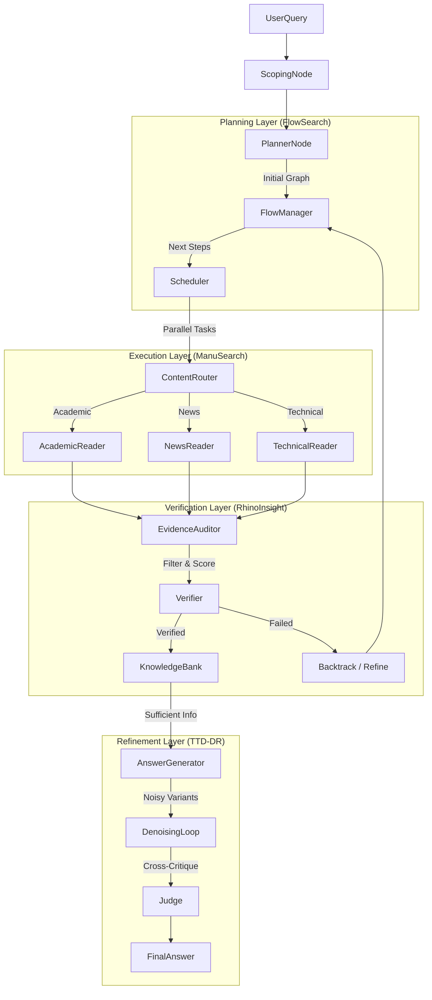

# Comprehensive SOTA Deep Research Implementation Guide

## Executive Summary
This guide synthesizes state-of-the-art (SOTA) techniques from academic papers and open-source implementations to build a "Best of Breed" Deep Research Agent. By combining dynamic planning (FlowSearch), structured extraction (ManuSearch), verification (RhinoInsight), and iterative refinement (TTD-DR), we aim to create a system that exceeds the capabilities of any single framework.

## 1. Unified Architecture: "The Cognitive Loop"

We propose a unified architecture running on **LangGraph** that integrates these distinct capabilities into a coherent cognitive loop.



### Key Components

1.  **Dynamic Flow Planning (FlowSearch)**
    *   *Concept*: Instead of a static list of questions, maintain a dependency graph of knowledge.
    *   *Benefit*: Allows the agent to "change its mind" and backtrack when a search path hits a dead end, rather than hallucinating an answer.
    *   *Implementation*: A `FlowGraph` state object in LangGraph that tracks `completed_nodes`, `frontier_nodes`, and `failed_nodes`.

2.  **Domain-Specific Readers (ManuSearch)**
    *   *Concept*: Different content types (papers vs. news vs. docs) require different extraction strategies.
    *   *Benefit*: significantly higher extraction quality and less noise.
    *   *Implementation*: A `Router` node that classifies URLs/Content and dispatches to specialized `extract_academic`, `extract_news`, etc.

3.  **Verifiable Checklists (RhinoInsight)**
    *   *Concept*: Explicit success criteria for every sub-goal.
    *   *Benefit*: Prevents premature stopping. The agent knows *when* it is done.
    *   *Implementation*: A `ChecklistItem` dataclass with a `verify(evidence)` method that returns a confidence score.

4.  **Test-Time Denoising (TTD-DR)**
    *   *Concept*: Generate multiple diverse drafts and use them to critique and improve each other.
    *   *Benefit*: Reduces hallucinations and "tunnel vision" by forcing the model to consider alternative perspectives.
    *   *Implementation*: A `generate_variants` node followed by a `denoise` loop that takes `other_variants` as context.

## 2. Implementation Strategy

### Phase 1: The Core (Flow + Readers)
*Goal: Move beyond linear "search-summary" loops.*

**Step 1.1: Define the `FlowState`**
Replace the simple `messages` list with a structured state.

```python
from typing import TypedDict, List, Literal

class KnowledgeNode(TypedDict):
    id: str
    type: Literal['query', 'search', 'extract', 'conclude']
    content: str
    status: Literal['pending', 'success', 'failed']
    parent_id: str | None

class FlowState(TypedDict):
    query: str
    nodes: List[KnowledgeNode]
    frontier: List[str]  # IDs of nodes ready to execute
    knowledge_bank: List[dict]  # Verified evidence
```

**Step 1.2: Implement Domain Readers**
Create specialized prompt templates for extraction.

```python
# readers/academic.py
ACADEMIC_PROMPT = """
Analyze this academic text. Extract:
1. Methodology (specific algorithms/steps)
2. Quantitative Results (metrics, p-values)
3. Limitations explicitly stated by authors
"""

# readers/news.py
NEWS_PROMPT = """
Analyze this news article. Extract:
1. Core Event (What happened?)
2. Sources cited (Who said it?)
3. Timeline of events
"""
```

### Phase 2: The Guardrails (Verification)
*Goal: Stop the agent from lying.*

**Step 2.1: Evidence Auditor**
Before adding data to the `KnowledgeBank`, run it through an auditor.

```python
def audit_evidence(evidence, criteria):
    """
    Scores evidence against the criteria.
    Returns: Score (0-1) and Reason.
    """
    # ... LLM Call ...
    if score < 0.7:
        return None # Discard
    return verified_evidence
```

### Phase 3: The Polish (Denoising)
*Goal: Produce human-expert quality reports.*

**Step 3.1: Variant Generation**
Don't just ask for "the answer". Ask for:
1.  A "Skeptical" answer (focus on what we don't know).
2.  A "Optimistic" answer (focus on potential).
3.  A "Technical" answer (focus on details).

**Step 3.2: Cross-Pollination**
Feed these variants back into the LLM:
*"Here are 3 perspectives. Write a final answer that resolves the conflicts between them and synthesizes the best evidence from each."*

## 3. Comparison with Current Baseline

| Feature | Current Baseline | Proposed SOTA Implementation |
| :--- | :--- | :--- |
| **Planning** | Static list of queries | Dynamic Graph (FlowSearch) |
| **Extraction** | Generic "summarize this" | Domain-aware (ManuSearch) |
| **Stopping** | When loop hits N steps | When checklist is verified (RhinoInsight) |
| **Synthesis** | Single pass generation | Multi-variant denoising (TTD-DR) |

## 4. Migration Plan

1.  **Refactor `State`**: Update `OverallState` to include `FlowGraph` elements.
2.  **Add `readers/` directory**: Implement the specialized extractors.
3.  **Update `graph.py`**: Insert the `Auditor` node between Search and Context update.
4.  **Evaluation**: Run `DeepResearch-Bench` (subset) to quantify improvements.
